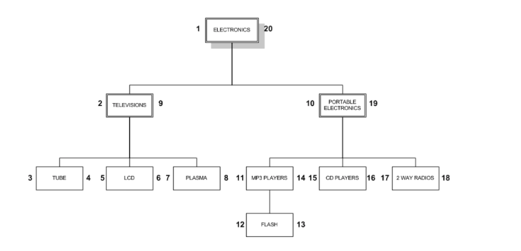
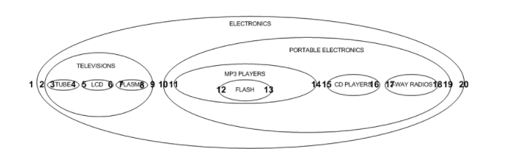

# Nested Set Model 
Simple nested set model (java)implementation for managing hierarchical data in an SQL database.
The term was apparently introduced by Joe Celko. Others describe the same technique using different terms. Google 'Celko' or 'nested set model' for more info.

# Introduction
The Nested Set Model is an approach to storing hierarchical data structures in relational databases.
It is an alternative to more common Adjacency List Model.
The Nested Set Model has a clear advantage over Adjacency List Model for operations like finding path for a demoNode, retrieving the whole tree, finding depth of a demoNode etc.
For example, in Adjacency List it is impossible to find a path for a demoNode with pure SQL without knowing the depth of that demoNode.
On the other hand, create/delete operations in Nested Set Model are much more complicated, since these operations cause the recalculation of "left" and "right" values for the whole tree.
As a consequence to the aforementioned, the write lock on the table is necessary for create/delete, which would require a stored procedure or SERIALIZABLE isolation level (may lead to heavy performance problems).

Summing up, the Nested Set Model is suitable for systems where different reads are frequent while writes are not needed or usually occur in batch at predefined time.

This project demonstrates Spring Data JPA powered implementation of different reads in the Nested Set Model.

# Implemented operations

 - retrieval of all leaf demoNodes
 - path retrieval
 - retrieval of child demoNodes for a demoNode
 - retrieval of a demoNode depth

# How to run
Run `mvn test` from the project root (requires Maven 3).

## Example hierarchy used in test case

### https://github.com/deyvid5/nestedset-java-spring
### https://github.com/mynewsdesk/nested-set

## The "nested set" view

## Api
- Boolean isInTree
- Boolean isRoot
- Boolean isLeaf
- Node makeRoot
- Integer sumValue
- Boolean isDescendantOf(Node parent)
- Boolean inAncestorOf(Node child)
- Boolean hasParent
- Boolean hasChildren
- Boolean isValid
- Node insertAsFirstChildOf(Node parent)
- Node insertAsLastChildOf(Node parent) 

Service methods: 
- Node createNode();
- void update(Node n);
- void save(Node n);
- Node fillWithExampleData(Node n);
- Node findRoot();
- List<Node> getChildren(Node n);
- Integer countChildren(Node n);
- List<Node> getDescendants(Node n);
- Integer countDescendants(Node n);
- Node getFirstChild(Node n);
- Node getLastChild(Node n);
- List<Node> getSiblings(Node n);
- Node findOneById(Integer nodeId);
- List<Node> filterByDepth(Integer depth);
- Node getParent(Node n);
- void setParent(Node n);
- Integer deleteDescendants(Node n);
- List<Node> findWholeTree() throws Exception;
- void updateTreeCollection(Node n, boolean children, String direction);
- void updateTree(Node n, int newPos);
- Node addChildAsFirst(Node parent, String name, int value) throws Exception;
- Node addChildAsLast(Node parent, String name, int value) throws Exception;
- int getSumOfLeaf(Node leaf) throws Exception;
- void deleteNode(Node n);

## Docs refs
Here you can find pages I was using to build this implemention.
- http://ops-welt.blogspot.com/2009/03/nested-set-mit-hibernate-und-spring.html
- http://www.devme.it/more-more-and-more/nested-set-java-spring-postgresql-plpgsql-yahoo-framework/
- http://mikehillyer.com/articles/managing-hierarchical-data-in-mysql/
- http://members.chello.at/fritz.ritzberger/downloads/jpatreedao/JpaTreeDao.html
- http://www.waitingforcode.com/mysql/managing-hierarchical-data-in-mysql-nested-set/read
- https://github.com/romanb/JPA-NestedSet/blob/master/src/main/java/org/code_factory/jpa/nestedset/JpaNode.java
- http://we-rc.com/blog/2015/07/19/nested-set-model-practical-examples-part-i
